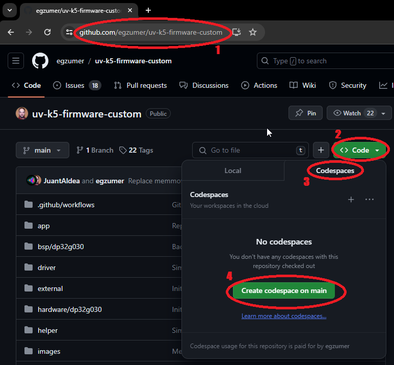
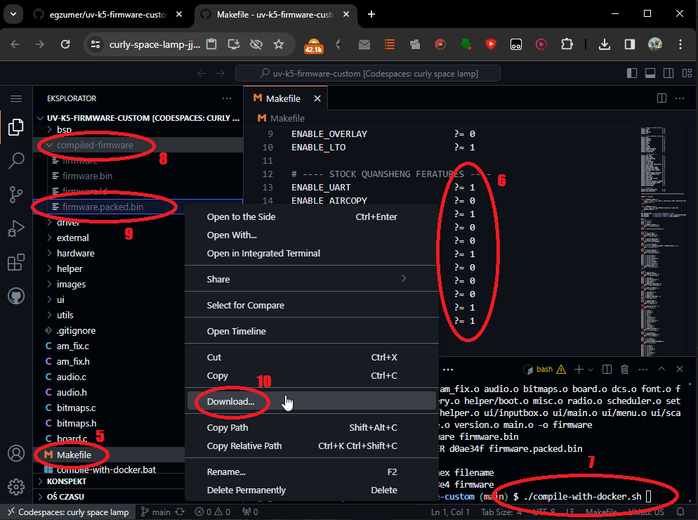

# Building the Firmware

> This document is adapted from the [egzumer/uv-k5-firmware-custom](https://github.com/egzumer/uv-k5-firmware-custom) repository.

---

## Table of Contents

- [Compiler](#compiler)
- [Github Codespace build method](#github-codespace-build-method)
- [Docker build method](#docker-build-method)
- [Windows environment build method](#windows-environment-build-method)

---

## Compiler

`arm-none-eabi` GCC version 10.3.1 is recommended, which is the current version on Ubuntu 22.04.03 LTS.
Other versions may generate a flash file that is too big.
You can get an appropriate version from: https://developer.arm.com/downloads/-/gnu-rm

Clang may be used but isn't fully supported. Resulting binaries may also be bigger.
You can get it from: https://releases.llvm.org/download.html

---

## Github Codespace build method

This is the least demanding option as you don't have to install anything on your computer. All you need is a GitHub account.

1. Go to https://github.com/egzumer/uv-k5-firmware-custom
2. Click the green **Code** button
3. Change the tab from **Local** to **Codespace**
4. Click the green **Create codespace on main** button



5. Open `Makefile`
6. Edit build options, save `Makefile` changes
7. Run `./compile-with-docker.sh` in the terminal window
8. Open the folder `compiled-firmware`
9. Right-click `firmware.packed.bin`
10. Click **Download** — now you should have a firmware on your computer that you can proceed to flash on your radio. You can use the [online flasher](https://egzumer.github.io/uvtools)



---

## Docker build method

If you have Docker installed you can use [`compile-with-docker.bat`](./compile-with-docker.bat) (Windows) or [`compile-with-docker.sh`](./compile-with-docker.sh) (Linux/Mac). The output files are created in the `compiled-firmware` folder. This method gives significantly smaller binaries — differences of up to 1 KB have been observed, so it can fit more functionality this way. The challenge can be (or not) installing Docker itself.

---

## Windows environment build method

1. Open a Windows command line and run:

    ```bat
    winget install -e -h git.git Python.Python.3.8 GnuWin32.Make
    winget install -e -h Arm.GnuArmEmbeddedToolchain -v "10 2021.10"
    ```

2. Close the command line, open a new one and run:

    ```bat
    pip install --user --upgrade pip
    pip install crcmod
    mkdir c:\projects & cd /D c:/projects
    git clone https://github.com/egzumer/uv-k5-firmware-custom.git
    ```

3. From now on you can build the firmware by going to `c:\projects\uv-k5-firmware-custom` and running `win_make.bat` or by running:

    ```bat
    cd /D c:\projects\uv-k5-firmware-custom
    win_make.bat
    ```

4. To reset the repository and pull new changes (⚠️ **this will delete all your changes!**):

    ```bat
    cd /D c:\projects\uv-k5-firmware-custom
    git reset --hard & git clean -fd & git pull
    ```

There are some notes left in the `win_make.bat` file to help with things.

---

*For the full README and other documentation, see the [main README](./README.md).*
